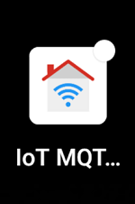
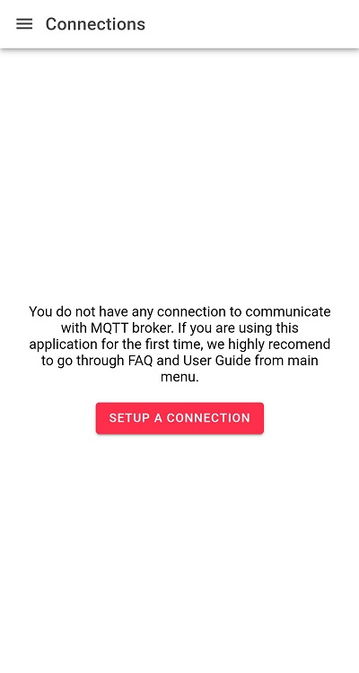
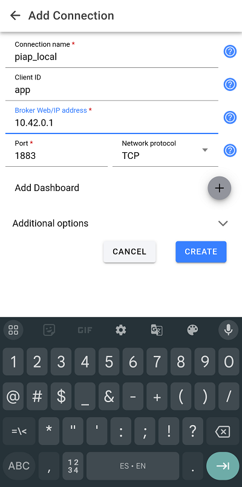
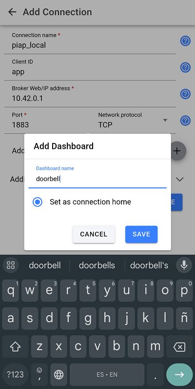
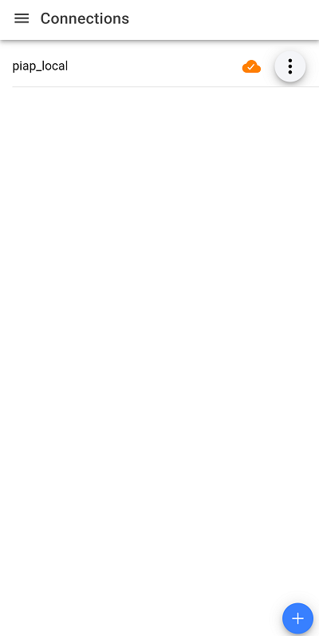
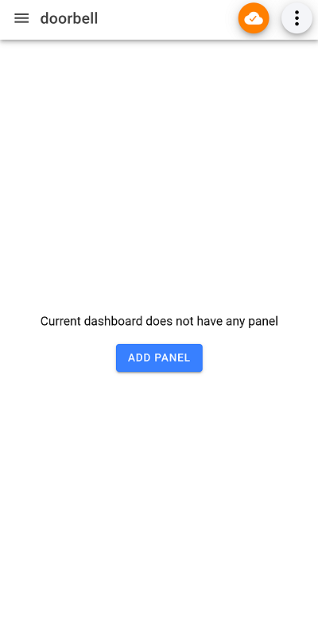
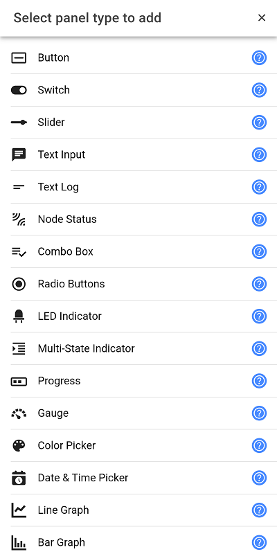
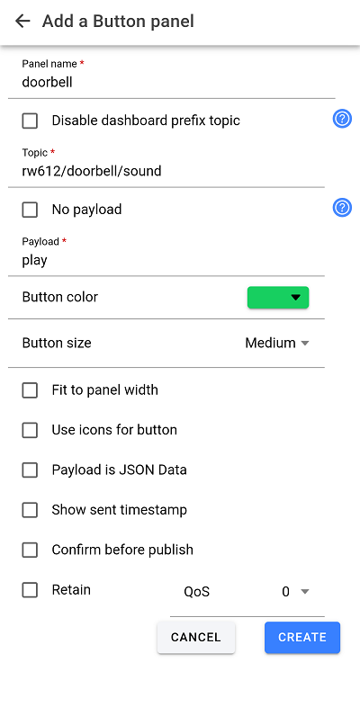
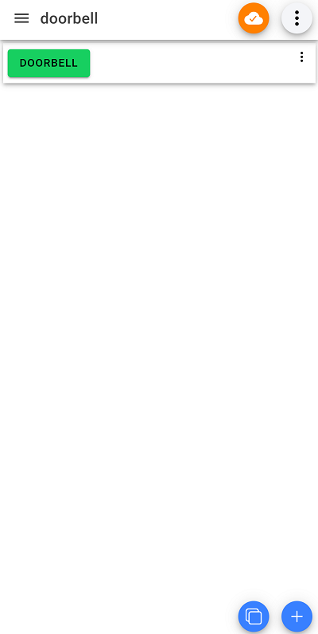

# Setting up the MQTT smart phone app
There are several Android and IOs applications that allow publishing to MQTT brokers. For this demo we are using [**IoT MQTT Panel**](https://play.google.com/store/apps/details?id=snr.lab.iotmqttpanel.prod&pcampaignid=web_share) on Android. This app is also available for iPhone users [here](https://apps.apple.com/pe/app/iot-mqtt-panel/id6466780124) (Instructions may change for iPhone).

## App setup
This app requires two things to connect:
 - A MQTT server connection
 - A panel inside of that connection to interact with the server either publishing or subscribing to MQTT topics.

When you open the app by the first time it will show an empty screen like this:

1. Click on the `SETUP A CONNECTION` button.
2. Fill the `Add Connection` form with the MQTT server information:

 **You can replace the Broker Web/IP address with your broker's URL (like broker.hivemq.com).**

3. Click on the `Add Dashboard` *+*  button and fill the dashboard name.

4. Click on `SAVE` on the `Add Dashboard` and `CREATE` on the `Add Connection` form.

Now you have a connection setup with your MQTT broker.

5. Click on your new connection.

6. Click on `ADD PANEL` and select the `Button` on the `Select panel type to add` menu.

7. Fill the `Add a Button panel` with your button's information. The most inportant fields are `Topic` and `Payload`. Every time you click the new button, the `Topic` will be published with the selected `Payload`.

8. Test your new button, press it and if the RW612 is connected then you should heard the doorbell sound.

