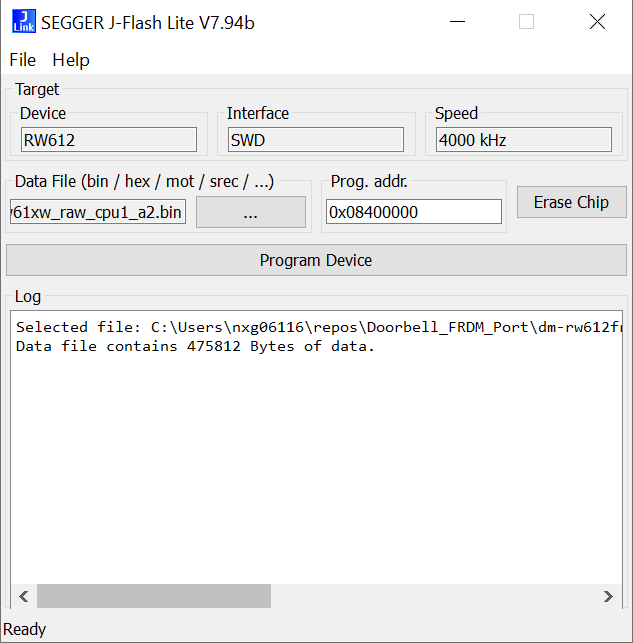
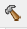

# NXP Application Code Hub

[](https://www.nxp.com)

## RW612-FRDM Door chime demo with MQTT over Wi-Fi and I2S audio output

This demo shows how to implement a wireless door chime with the RW612-FRDM board. <br />The chime is controlled over Wi-Fi with the MQTT application protocol. Chime sound data is streamed on the I2S pins of the RW612-FRDM Arduino header. An external codec and also an amplifier are required to play the sound on an external speaker.

#### Boards: FRDM-RW612

#### Categories: Audio, Networking, RTOS, Wireless Connectivity

#### Peripherals: I2S

#### Toolchains: MCUXpresso IDE

## Table of Contents

1. [Software](#step1)
2. [Hardware](#step2)
3. [Setup](#step3)
4. [Results](#step4)
5. [FAQs](#step5)
6. [Support](#step6)
7. [Release Notes](#step7)

## 1. Software<a name="step1"></a>

- MCUXpresso IDE v11.7.1
- FRDM-RW612 SDK (SDK\_2\_16\_0\_FRDM-RW612)
- [FRDM-RW612 Doorbell over Wi-Fi and MQTT Demo project](frdmrw612_Door_Chime)

## 2. Hardware<a name="step2"></a>

### Speaker with I2S interface/amp

#### Speaker

[](https://puiaudio.com/product/speakers-and-receivers/ASE02808MR-LW150-R)

##### Speaker configuration:

Plug in the positive and negative terminals of the speaker into the + and minus outputs of the I2S Amp (ADAFRUIT MAX98357A)

#### ADAFRUIT MAX98357A

[](https://www.adafruit.com/product/3006)

##### MAX98357A configuration:

Gain pin can be left unconnected for a 9dB default gain, refer to the datasheet to look at different gain configurations

### Wi-Fi Access point and MQTT server. By default this demo connects to an open MQTT Broker "HiveMQ" but the user can use a Raspberry PI 3B+ to configure its own Access Point and MQTT broker. To do so, you can follow this guide:

##### [Wi-Fi Access point and MQTT server setup guide](RaspberryPISetup.md)

### FRDM RW612 Board


## 3. Setup<a name="step3"></a>

#### Speaker with I2S interface/amp:

<li>Connect Vin pin of the speaker board into pin 10 of header J3 (5V)
<li>Connect GND pin of the speaker board into pin 12 of header J3 (GND)
<li>SD Pin can remain unconnected
<li>Gain Pin can remain unconnected
<li>Connect Din pin of the speaker board into pin 2 of header J1
<li>Connect BCLK pin of the speaker board into pin 12 of header J2
<li>Connect LRC pin of the speaker board into pin 4 of header J1 </li>

### Flash Wi-Fi firmware

The Wi-Fi firmware must be flashed once unless it is erased. It is stored at a given address. Ensure that the Wi-Fi firmware is flashed before running any Wi-Fi demo application.

Open J-Link commander on Windows and connect a uUSB cable between your host PC and the MCU-link port of the RW61x board. J-Link commander is part of the[ J-Link software and documentation pack](https://www.segger.com/downloads/jlink/). **RW61x support was added to the J-Link tools in version V7.92c**.

```
J-Link>con
Device>RW612
TIF>
SSpeed><Enter>
```

You can find the Wi-Fi secure firmware binary in the FRDM_RW612_SDK. Download it from the [MCUXpresso SDK Builder](https://https://mcuxpresso.nxp.com/en) (check this document's section 1 [SW](#step1) to confirm the right SDK version). Unzip the SDK file and locate the Wi-Fi firmware at **SDK_x_xx_xxxFRDM-RW612/components/conn_fwloader/fw_bin/rw61xw_raw_cpu1_a2.bin**

This is the J-Link commander command to load the Wi-Fi secure firmware into the RW61x flash.

```
J-Link>loadbin rw61xw_raw_cpu1_a2.bin,0x08400000
```

The J-Flash Lite tool can also be used for this:



### Wi-Fi Access point and MQTT broker

The demo's Wi-Fi credentials, user and password can be configured on the definitions section in [wifi_mqtt.c](frdmrw612_Door_Chime/source/wifi_mqtt.c).

```C
#ifndef AP_SSID
#define AP_SSID "my_network"
#endif

#ifndef AP_PASSWORD
#define AP_PASSWORD "my_password"
#endif

#define WIFI_NETWORK_LABEL "my_wifi"
```

The demo's MQTT broker Address/URL and port number can be configured on the definitions section in [mqtt_freertos.c](frdmrw612_Door_Chime/source/mqtt_freertos.c).

```C
/*! @brief MQTT server host name or IP address. */
#ifndef EXAMPLE_MQTT_SERVER_HOST
#define EXAMPLE_MQTT_SERVER_HOST "broker.hivemq.com"
#endif

/*! @brief MQTT server port number. */
#ifndef EXAMPLE_MQTT_SERVER_PORT
#define EXAMPLE_MQTT_SERVER_PORT 1883
```

With the default config, the board connects to the HievMQ broker trough the configured Wi-Fi network but you can use another broker in a custom Raspberry PI based Access Point. Instructions to setup the Raspberry PI can be found [here](RaspberryPISetup.md).

To connect to the custom Raspberry PI based broker, you need to replace the following line at [mqtt_freertos.c](frdmrw612_Door_Chime/source/mqtt_freertos.c) for the Access Point's IP set in the Raspberry PI (notice the following IPv4 address is just an example).

```C
#define EXAMPLE_MQTT_SERVER_HOST "10.2.14.25"
```

---

### How to run:

1. Import the project to MCUXpresso IDE (check this document's section 1 [SW](#step1) to confirm the MCUXpresso IDE version used) and build it using the button  .
2. Use the debugger button    to flash the application.
3. Using the Window's Device Manager, look for the COM port created for the MCULink embedded in the FRDM-RW612 board and open a serial terminal at 115200 kbps, 1 stop bit, no parity. (optional)
4. Run the demo.
5. The doorbell sounds when the board is connected
6. Use a MQTT application or script to publish to the *rw612/doorbell/sound* topic.
7. The doorbell's sound will be played every time the topic is published.

### Test Python scripts

There is a Python script that can be used to test the doorbell.
Scripts can be found in the [scripts](scripts/) folder.

* [doorbell_pub.py](scripts/doorbell_pub.py) - This script connects to the MQTT broker and publishes to the doorbell/sound.

The scripts require Paho-mqtt. Following steps are to install Paho-mqtt in the Raspberry PI.

```bash
$ sudo apt install python3-paho-mqtt
# Run the publisher test script
$ python ./doorbell_pub.py
```

## 4. Results<a name="step4"></a>

Once the app is running on the FRDM  a message will appear on the serial terminal with information about the network and the status of the connection, once successfully connected you are ready to publish messages through the IoT MQTT Panel app, your phone must be connected to the same network in order for the messages to be published

[i] Successfully initialized Wi-Fi module
[i] Connecting as client to ssid: piap with password austin00
PKG_TYPE: BGA
Set BGA tx power table data
[i] Connected to Wi-Fi - ssid: piap passphrase: austin00

IPv4 Address     : 10.42.0.21
IPv4 Subnet mask : 255.255.255.0
IPv4 Gateway     : 10.42.0.1

Connecting to MQTT broker at 10.42.0.1...
MQTT client "nxp_cc44fb9c3138f7a14c8dcfc5098e3e31" connected.
Subscribing to the topic "rw612/doorbell/#" with QoS 1...
Play
Subscribed to the topic "rw612/doorbell/#".

#### Publishing with the APP

Follow the instructions on the [MqttAppSetup.md](MqttAppSetup.md) guide to setup and use an smartphone app to send MQTT messages to the RW612 board.


### 24 bit audio streaming

This demo streams 24 bit audio over I2S between the FRDM-RW612 and the I2S speaker. Since the demo uses DMA Samples need to be padded to 32 bits. For instance a 24 bit sample like this: [0xaa, 0xbf, 0xfe] requires an extra byte 0 at the end, like this: [0xaa, 0xbf, 0xfe, 0x00].

Memory usage (Release config -Os)


| Memory region | Used Size   | Region Size | %age Used |
| ------------- | ----------- | ----------- | --------- |
| QSPI_FLASH:   | 1,630,675 B | 8 MB        | 19.44%    |
| SRAM:         | 271,652 B   | 1,216 KB    | 21.82%    |

**The doorchime sound array is 1,150,624 Bytes long**

When a publish has been done successfully through the app, The speaker will play a doorbell sound and the FRDM will output the following message in it's serial port:

```
Received 4 bytes from the topic "rw612/doorbell/sound": "Play
play"
```

## 5. FAQs<a name="step5"></a>

No FAQs have been identified for this project.

## 6. Support<a name="step6"></a>

#### Project Metadata

<!----- Boards ----->

[](https://github.com/search?q=org%3Anxp-appcodehub+FRDM-RW612+in%3Areadme&type=Repositories)

<!----- Categories ----->

[](https://github.com/search?q=org%3Anxp-appcodehub+audio+in%3Areadme&type=Repositories) [](https://github.com/search?q=org%3Anxp-appcodehub+networking+in%3Areadme&type=Repositories) [](https://github.com/search?q=org%3Anxp-appcodehub+rtos+in%3Areadme&type=Repositories) [](https://github.com/search?q=org%3Anxp-appcodehub+wireless_connectivity+in%3Areadme&type=Repositories)

<!----- Peripherals ----->

[](https://github.com/search?q=org%3Anxp-appcodehub+i2s+in%3Areadme&type=Repositories)

<!----- Toolchains ----->

[](https://github.com/search?q=org%3Anxp-appcodehub+mcux+in%3Areadme&type=Repositories)

Questions regarding the content/correctness of this example can be entered as Issues within this GitHub repository.

> **Warning**: For more general technical questions regarding NXP Microcontrollers and the difference in expected functionality, enter your questions on the [NXP Community Forum](https://community.nxp.com/)

[](https://www.youtube.com/@NXP_Semiconductors)
[](https://www.linkedin.com/company/nxp-semiconductors)
[](https://www.facebook.com/nxpsemi/)
[](https://twitter.com/NXP)

## 7. Release Notes<a name="step7"></a>


| Version | Description / Update                                   |                      Date |
| :-----: | ------------------------------------------------------ | ------------------------: |
|   1.0   | Initial release on Application Code Hub                | June 10<sup>th</sup> 2024 |
|   1.1   | Door Chime project files added on Application Code Hub | June 18<sup>th</sup> 2024 |

<small>
<b>Trademarks and Service Marks</b>: There are a number of proprietary logos, service marks, trademarks, slogans and product designations ("Marks") found on this Site. By making the Marks available on this Site, NXP is not granting you a license to use them in any fashion. Access to this Site does not confer upon you any license to the Marks under any of NXP or any third party's intellectual property rights. While NXP encourages others to link to our URL, no NXP trademark or service mark may be used as a hyperlink without NXP’s prior written permission. The following Marks are the property of NXP. This list is not comprehensive; the absence of a Mark from the list does not constitute a waiver of intellectual property rights established by NXP in a Mark.
</small>
<br>
<small>
NXP, the NXP logo, NXP SECURE CONNECTIONS FOR A SMARTER WORLD, Airfast, Altivec, ByLink, CodeWarrior, ColdFire, ColdFire+, CoolFlux, CoolFlux DSP, DESFire, EdgeLock, EdgeScale, EdgeVerse, elQ, Embrace, Freescale, GreenChip, HITAG, ICODE and I-CODE, Immersiv3D, I2C-bus logo , JCOP, Kinetis, Layerscape, MagniV, Mantis, MCCI, MIFARE, MIFARE Classic, MIFARE FleX, MIFARE4Mobile, MIFARE Plus, MIFARE Ultralight, MiGLO, MOBILEGT, NTAG, PEG, Plus X, POR, PowerQUICC, Processor Expert, QorIQ, QorIQ Qonverge, RoadLink wordmark and logo, SafeAssure, SafeAssure logo , SmartLX, SmartMX, StarCore, Symphony, Tower, TriMedia, Trimension, UCODE, VortiQa, Vybrid are trademarks of NXP B.V. All other product or service names are the property of their respective owners. © 2021 NXP B.V.
</small>