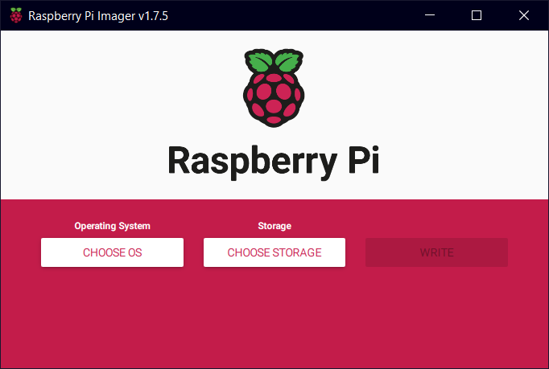
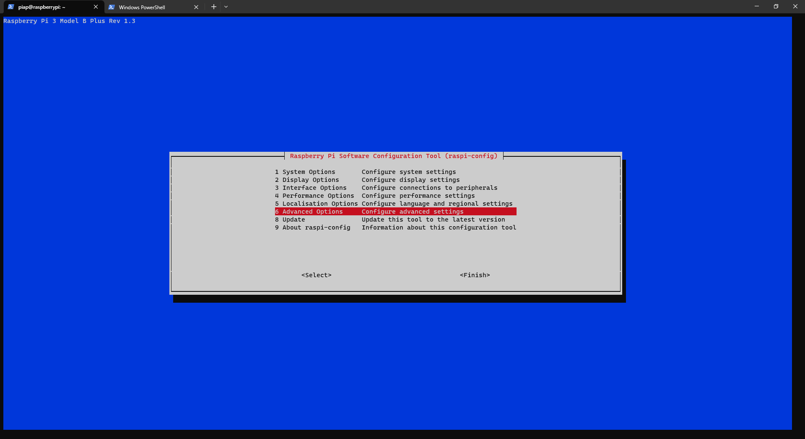

# Setting up the Raspberry PI access point
This guide was made with a Raspberry PI 3B+.

### Creating a Raspberry Pi image with the Raspberry Pi Imager tool
[This guide](https://www.raspberrypi.com/documentation/computers/getting-started.html#setting-up-your-raspberry-pi) walks you through the process of creating the Raspberry PI OS image and performing basic configs with the Raspberry PI Imager tool.



The tool can also be used to write an already prepared image file (.img) to an SD card.

Use the instructions from [this guide](https://www.raspberrypi.com/documentation/computers/configuration.html#set-up-a-headless-raspberry-pi) if setting up a headless Raspberry PI.

Use the raspi-config tool to set the proxy settings if you are in a network that requires proxy like NXP's corporate network.



### Setup the Wi-Fi access point

Following command creates a Wi-Fi network with these settings:

* SSID: piap
* WPA Password: austin00

```bash
$ sudo nmcli device wifi hotspot ssid piap password austin00
```

There is an explanation on how to host a wireless network on your Raspberry PI [here](https://www.raspberrypi.com/documentation/computers/configuration.html#host-a-wireless-network-on-your-raspberry-pi).

### Setup the Mosquitto MQTT broker

Install Mosquitto

$ sudo apt-get update
$ sudo apt-get install mosquitto

Create a Mosquito configuration file mosquito.conf with the following content:
```bash
# Enable listener on port 1883
listener 1883
# Listen just on IPv4
socket_domain ipv4
# Listen on Wi-Fi only
bind_interface wlan0
# Allow clients without username
allow_anonymous true
```

Stop the mosquitto service
```bash
$ sudo systemctl disable mosquitto
$ sudo systemctl status mosquitto
```

Start mosquitto with the new configuration:
```bash
$ mosquitto -c ./mosquitto.conf -d
```

You can edit the rc.local file to start the Wi-Fi hotspot and Mosquitto broker at boot time. Just follow [these instructions] (https://raspberrypi-guide.github.io/programming/run-script-on-boot).
